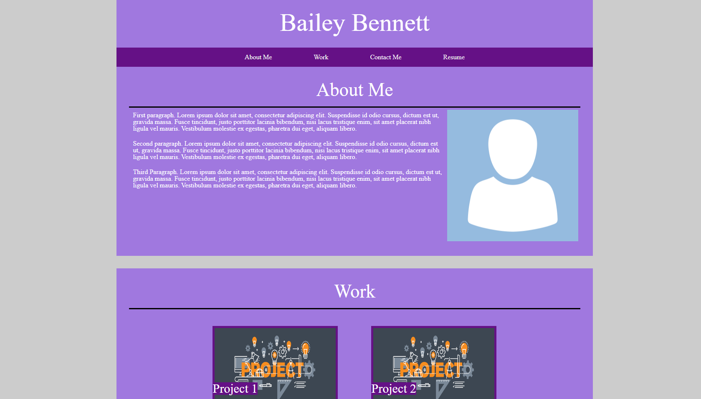

## My Portfolio

## About The Project

This is my portfolio.

Preview: 

### Built With

* VS Code
* HTML
* CSS


## Getting Started

To get a local copy up and running follow these simple steps.

### Prerequisites

This is an example of how to list things you need to use the software and how to install them.
* npm
  ```sh
  npm install npm@latest -g
  ```

### Installation

1. Clone the repo
   ```sh
   git clone https://github.com/BaileyB227/BaileyBennettPortfolio.git
   ```
2. Install NPM packages
   ```sh
   npm install
   ```


## Usage

Showing future employers my progress as a programmer.


## Contact

Bailey Bennett - baileyb227@gmail.com

Project Link: [https://github.com/BaileyB227/BaileyBennettPortfolio](https://github.com/BaileyB227/BaileyBennettPortfolio)